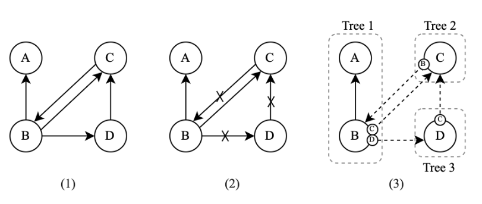

# Aelastics-types
The `aelastics-types` library is a TypeScript library used for defining and manipulating complex application state models in a graph-like structure. This library provides methods that allows developers to define and manage entities with bi-directional relationships. This type definition can be combined with the use of the `aelastics-store` library to decompose it in a set of interconnected trees in order to manage updates.

## Key features
- **Entity Definition**: Define entities with complex relationships.
- **State Decomposition**: Decompose states into a set of interconnected trees for efficient management and manipulation.
- **Graph-like Relationships**: Utilize entities to form graph-like structures within the state models.

### Main library types and utilities
| Type/Utility           | Description |
|------------------------|-------------|
| `string`             | Represents a string type. |
| `number`             | Represents a number type. |
| `boolean`            | Represents a boolean type. |
| `date`               | Represents a date type. |
| `array`              | Represents an array type, can hold multiple elements of a specified type. |
| `object`             | Represents an object type with a specific structure. |
| `entity`             | Defines an entity with specific properties and relationships. |
| `entityReference`    | Creates a reference to another entity, allowing for relationships between entities. |
| `union`              | Creates a type that can be one of several specified types. |
| `intersection`       | Combines multiple types into one, requiring all properties of the combined types. |
| `enum`               | Defines an enumeration, a set of named values. |
| `tuple`              | Defines a fixed-length array with specific types for each element. |
| `literal`            | Represents a specific literal value. |
| `optional`           | Marks a type as optional, meaning it may or may not be present. |
| `nullable`           | Allows a type to be null. |
| `readonly`           | Marks a property as read-only, preventing modification after initialization. |
| `default`            | Specifies a default value for a type if none is provided. |
| `validate`           | Validates data against a specified type. |
| `is`                 | Type guard function to check if a value matches a type. |
| `assert`             | Asserts that a value matches a type, throwing an error if it does not. |
| `inverseProps`| used to define inverse properties in bi-directional relationships.|


### Core methods for relationships definition
#### Direct relationships
When defining a type that includes a direct reference to another type, you typically use `entityReference` to define a property that holds a direct uni-directional reference to another object or entity. This is useful for creating one-to-one and one-to-many uni-directional relationships.

#### Composed relationships
The `link` method is used to defined relationships between entities(bi-directional). It creates a link or reference from one entity to another. This is particularly useful for defining relationships such as one-to-one, one-to-many, or many-to-many between different entities.

The `inverseProps` method is used to define inverse properties in bi-directional relationships. This ensures that changes in one direction of the relationship are automatically reflected in the opposite direction, maintaining consistency between related entities.


## Basic usage
The example defines four different elements of an application state: `A` as an object type, and `B`, `C`, and `D` as entity types. The lines between entities represent the relationships between these.


Importing all exported methods from the library will give the developer access to all available methods for type definition:

### Import all available types
```ts
import * as t from "aelastics-types"
```

### Schema definition
Defining a schema in the `aelastics-types` library is crucial as it serves as the blueprint for the application state model. The schema defines the structure, relationships, and constraints of the entities within the application. By creating a schema, you ensure that the data adheres to a consistent format, enabling efficient state management and updates.
```ts
export const ExampleSchema = t.schema("ExampleSchema")
```

### Types and relationships definition
#### Step 1 - Schema and type definition
In this step, you define the schema and the types that represent the entities and their relationships within the application. Each entity is defined with its properties and the relationships it holds with other entities.
```ts
// Type definition
const AType = t.object({
  name: "A"
}, 
"A",
ExampleSchema)

const BType = t.entity({
  id: "1",
  name: "B",
  bToARelation: AType,
  bToCRelation: t.link(SimpleSchema, "bToCRelation", "bToCLink"),
  bToDRelation: t.link(SimpleSchema, "bToDRelation", "bToDLink"),
}, 
["id"],
"B",
ExampleSchema)

const CType = t.entity({
  id: "2",
  name: "C",
  cToBRelation: t.link(SimpleSchema, "cToBRelation", "ctoBLink"),
}, 
["id"],
"C",
ExampleSchema)

const DType = t.entity({
  id: "3",
  name: "C",
  dToCRelation: t.link(SimpleSchema, "dToCRelation", "dToCLink"),
}, 
["id"],
"D",
ExampleSchema)

// Inverse properties definition

```

This type definition can then be exported to be used in the instantiation of new state objects through the use of the `aelastics-store` library in the following way:
```ts
export type IAType = t.TypeOf<typeof AType>
export type IBType = t.TypeOf<typeof BType>
export type IBType = t.TypeOf<typeof CType>
export type IBType = t.TypeOf<typeof DType>
```

#### Step 2 - Graph relationships decomposition
The decomposition of graph relationships into interconnected trees is a core feature of the `aelastics-store` library, that needs to be used in conjunction with the `aelastics-types` library. This decomposition helps manage the state efficiently by breaking down complex graphs into simpler, manageable trees.

For further references, the following files can be targeted in order to better understand this process:

`immutable-store.ts`: this file is responsible for managing the immutable state of the application. It provides methods to handle state updates while ensuring immutability, which is crucial for predictable state management and debugging.

`createClass.ts`: this file contains logic for creating classes that represent entities and their relationships. It defines how entities are instantiated and ensures that the relationships between them are correctly established and maintained.

`propsCreatorsWithUndo.ts`: this file provides functionality for creating properties with undo capabilities. It allows tracking changes to the properties of entities and provides mechanisms to revert changes if needed. This is particularly useful in scenarios where state changes need to be reversible, such as in collaborative applications or when implementing undo-redo functionality.

#### Step 3 - Interconnected trees state representation
The interconnected trees state representation is the result of decomposing the graph relationships defined in the schema. By representing the state as a set of interconnected trees, the framework can efficiently manage and update the state, ensuring consistency and performance.

The interconnected trees allow the framework to traverse and manipulate the state model in a structured manner, making it easier to apply updates, propagate changes, and maintain the integrity of the relationships between entities.


## AelasticS typescript-library-starter

git push --set-upstream https://gitlab.com/myName/myProject.git master
git remote add  origin https://gitlab.com/myName/myProject.git

### NPM scripts

 - `npm t`: Run test suite
 - `npm start`: Run `npm run build` in watch mode
 - `npm run test:watch`: Run test suite in [interactive watch mode](http://facebook.github.io/jest/docs/cli.html#watch)
 - `npm run test:prod`: Run linting and generate coverage
 - `npm run build`: Generate bundles and typings, create docs
 - `npm run lint`: Lints code
 - `npm run commit`: Commit using conventional commit style ([husky](https://github.com/typicode/husky) will tell you to use it if you haven't :wink:)

### Excluding peerDependencies

On library development, one might want to set some peer dependencies, and thus remove those from the final bundle. You can see in [Rollup docs](https://rollupjs.org/#peer-dependencies) how to do that.

Good news: the setup is here for you, you must only include the dependency name in `external` property within `rollup.config.js`. For example, if you want to exclude `lodash`, just write there `external: ['lodash']`.

### Automatic releases

_**Prerequisites**: you need to create/login accounts and add your project to:_
 - [npm](https://www.npmjs.com/)
 - [Travis CI](https://travis-ci.org)
 - [Coveralls](https://coveralls.io)


#### Setup steps

Follow the console instructions to install semantic release and run it (answer NO to "Do you want a `.travis.yml` file with semantic-release setup?").

_Note: make sure you've setup `repository.url` in your `package.json` file_

```bash
npm install -g semantic-release-cli
semantic-release-cli setup
# IMPORTANT!! Answer NO to "Do you want a `.travis.yml` file with semantic-release setup?" question. It is already prepared for you :P
```

From now on, you'll need to use `npm run commit`, which is a convenient way to create conventional commits.

Automatic releases are possible thanks to [semantic release](https://github.com/semantic-release/semantic-release), which publishes your code automatically on [github](https://github.com/) and [npm](https://www.npmjs.com/), plus generates automatically a changelog. This setup is highly influenced by [Kent C. Dodds course on egghead.io](https://egghead.io/courses/how-to-write-an-open-source-javascript-library)

### Git Hooks

There is already set a `precommit` hook for formatting your code with Prettier :nail_care:

By default, there are two disabled git hooks. They're set up when you run the `npm run semantic-release-prepare` script. They make sure:
 - You follow a [conventional commit message](https://github.com/conventional-changelog/conventional-changelog)
 - Your build is not going to fail in [Travis](https://travis-ci.org) (or your CI server), since it's runned locally before `git push`

This makes more sense in combination with [automatic releases](#automatic-releases)

